# Dei BioPharma ERP — HR Microservice Database Architecture & ERD Mapping

An enterprise-grade, multi-facility, and versioned database schema designed for **Dei BioPharma Ltd.** (Matugga GMP, Kakiika Clinical, Nakaseke Bio-Agro, and Corporate HQ).

---

## 1. 📊 Visual Entity Relationship Diagram (ERD)

```mermaid
erDiagram
    ORGANIZATION_UNITS ||--o{ EMPLOYEES : "employs"
    ORGANIZATION_UNITS ||--o{ SHIFT_ASSIGNMENTS : "schedules at"
    ORGANIZATION_UNITS ||--o{ PAYROLL_RUNS : "runs payroll for"

    EMPLOYEES ||--o{ EMPLOYEE_DEPENDENTS : "has family"
    EMPLOYEES ||--o{ EMERGENCY_CONTACTS : "designates"
    EMPLOYEES ||--o{ EDUCATION_RECORDS : "holds degrees"
    EMPLOYEES ||--o{ EMPLOYMENT_HISTORY : "has past experience"
    EMPLOYEES ||--o{ EMPLOYEE_CERTIFICATIONS : "maintains licenses"
    EMPLOYEES ||--o{ SHIFT_ASSIGNMENTS : "assigned to"
    EMPLOYEES ||--o{ PAYSLIPS : "receives"

    PAYROLL_RUNS ||--o{ PAYSLIPS : "contains"

    EMPLOYEES {
        bigint id PK
        uuid user_id FK "Nullable link to IAM user account"
        bigint organization_unit_id FK "Facility: Matugga, Kakiika, etc."
        varchar employee_number "e.g. DEI-MAT-0142"
        varchar full_name "Full Legal Name"
        varchar national_id_nin "Uganda National ID / Passport"
        date date_of_birth
        varchar gender "MALE, FEMALE, OTHER"
        varchar marital_status "SINGLE, MARRIED, DIVORCED, WIDOWED, SEPARATED"
        varchar place_of_residence
        varchar city
        varchar phone_number
        varchar personal_email
        varchar job_title "e.g. Senior Bioprocess Scientist"
        varchar department "e.g. Upstream Vaccine Fermentation"
        bigint manager_supervisor_id FK "Self-referencing manager"
        date hire_date "Start Date"
        varchar employment_status "FULL_TIME, PART_TIME, CONTRACT"
        varchar employment_type "PERMANENT, EXPATRIATE, SEASONAL"
        varchar base_currency "USD, UGX"
        decimal base_salary
        varchar status "ACTIVE, ON_LEAVE, SUSPENDED, TERMINATED"
        varchar form_version "e.g. v1.0, v2.0 for audit history"
        jsonb custom_fields "Dynamic facility fields (BSL-3, gowning level, etc.)"
        timestamp created_at
        timestamp updated_at
    }

    EMPLOYEE_DEPENDENTS {
        bigint id PK
        bigint employee_id FK
        varchar relationship_type "SPOUSE, CHILD, PARENT, SIBLING, OTHER"
        varchar full_name
        date date_of_birth
        integer age
        varchar gender "MALE, FEMALE"
        varchar phone_number "Spouse phone if applicable"
        boolean is_emergency_contact
        timestamp created_at
    }

    EMERGENCY_CONTACTS {
        bigint id PK
        bigint employee_id FK
        integer priority "1 or 2"
        varchar contact_name
        varchar relationship "e.g. Spouse, Brother, Mother"
        varchar primary_phone
        varchar alternate_phone
        timestamp created_at
    }

    EDUCATION_RECORDS {
        bigint id PK
        bigint employee_id FK
        varchar degree_title "Highest Degree / Certificate / Diploma"
        varchar institution "University / College"
        integer graduation_year
        varchar grade_classification
        timestamp created_at
    }

    EMPLOYMENT_HISTORY {
        bigint id PK
        bigint employee_id FK
        varchar previous_employer
        varchar job_title
        varchar duration_from_to "e.g. 2020 - 2024"
        text key_responsibilities
        timestamp created_at
    }

    EMPLOYEE_CERTIFICATIONS {
        bigint id PK
        bigint employee_id FK
        varchar cert_type "GMP_CLEANROOM, GCP_CLINICAL, GAP_ORGANIC, BSL3"
        varchar cert_name "e.g. Grade A Aseptic Gowning Qualification"
        varchar issuing_body "e.g. WHO / NDA / Dei Quality Unit"
        varchar license_number
        date issue_date
        date expiry_date
        varchar verification_status "VALID, EXPIRING_SOON, EXPIRED"
        timestamp created_at
    }

    SHIFT_ASSIGNMENTS {
        bigint id PK
        bigint employee_id FK
        bigint organization_unit_id FK
        varchar shift_code "SHIFT_A_MORNING, SHIFT_B_EVENING, SHIFT_C_NIGHT"
        varchar production_line "e.g. Bioreactor Line 1, Lyophilization"
        date start_date
        date end_date
        varchar status "SCHEDULED, ON_DUTY, COMPLETED, ABSENT"
        timestamp created_at
    }

    PAYROLL_RUNS {
        bigint id PK
        bigint organization_unit_id FK
        varchar batch_number "e.g. PAY-2026-08-MAT"
        varchar period_month_year "August 2026"
        varchar currency "USD, UGX"
        decimal total_gross_pay
        decimal total_nssf_employer "10%"
        decimal total_nssf_employee "5%"
        decimal total_paye_tax "Uganda URA PAYE"
        decimal total_net_disbursed
        varchar status "DRAFT, REVIEWED, APPROVED, DISBURSED"
        timestamp processed_at
    }

    PAYSLIPS {
        bigint id PK
        bigint payroll_run_id FK
        bigint employee_id FK
        decimal base_salary
        decimal hazard_allowance "BSL-3 / Biotech Hazard Pay"
        decimal overtime_allowance
        decimal gross_pay
        decimal nssf_employee_deduction "5%"
        decimal paye_tax_deduction "Uganda PAYE"
        decimal local_service_tax "LST"
        decimal other_deductions
        decimal net_pay
        varchar payment_method "BANK_TRANSFER, MOBILE_MONEY"
        varchar bank_name
        varchar bank_account_no
        varchar status "GENERATED, PAID"
        timestamp created_at
    }
```



---

## 2. 📋 Bio-Data Form ➔ Database Column Mapping

| Paper Bio-Data Field | Database Table | Target Column | Data Type | Notes / Extensibility |
| :--- | :--- | :--- | :--- | :--- |
| **Full Name** | `employees` | `full_name` | `VARCHAR(255)` | Legal identity |
| **Start Date** | `employees` | `hire_date` | `DATE` | Operational start date |
| **Date of Birth** | `employees` | `date_of_birth` | `DATE` | Date format `YYYY-MM-DD` |
| **Gender** | `employees` | `gender` | `VARCHAR(20)` | `MALE`, `FEMALE`, `OTHER` |
| **Marital status** | `employees` | `marital_status` | `VARCHAR(30)` | `SINGLE`, `MARRIED`, `DIVORCED`, `WIDOWED`, `SEPARATED` |
| **Place of Residence & City** | `employees` | `place_of_residence`, `city`| `VARCHAR(255)` | Address & Region |
| **Phone Number & Email** | `employees` | `phone_number`, `personal_email` | `VARCHAR(100)` | Contact info |
| **NIN Number** | `employees` | `national_id_nin` | `VARCHAR(50)` | Uganda National ID (Unique) |
| **Name of Spouse & Phone** | `employee_dependents` | `full_name`, `phone_number` | `VARCHAR(255)` | `relationship_type = 'SPOUSE'` |
| **Children's Details (Table)** | `employee_dependents` | `full_name`, `date_of_birth`, `age`, `gender` | Multiple rows | `relationship_type = 'CHILD'` (Supports unlimited children) |
| **Job Title & Department** | `employees` | `job_title`, `department` | `VARCHAR(255)` | Scoped to facility |
| **Manager/Supervisor** | `employees` | `manager_supervisor_id` | `BIGINT` | Self-referencing FK to `employees.id` |
| **Employment Status** | `employees` | `employment_status` | `VARCHAR(50)` | `FULL_TIME`, `PART_TIME`, `CONTRACT` |
| **Emergency Contact 1 & 2** | `emergency_contacts` | `contact_name`, `relationship`, `primary_phone`, `alternate_phone` | Multiple rows | `priority = 1` or `2` |
| **Education Background** | `education_records` | `degree_title`, `institution`, `graduation_year` | Multiple rows | Highest degree attained |
| **Professional Experience** | `employment_history` | `previous_employer`, `job_title`, `duration_from_to` | Multiple rows | Career background |
| **Languages Spoken** | `employees` | `custom_fields->'languages'` | `JSONB` | Array: `["English", "Luganda", "Runyankole"]` |
| **Facility-Specific Certs** | `employee_certifications` | `cert_type`, `cert_name`, `license_number`, `expiry_date` | Multiple rows | Cleanroom Gowning, GCP, Organic GAP |

---

## 3. 🗄️ Production SQL DDL Schema (PostgreSQL / CockroachDB)

```sql
-- ============================================================================
-- DEI BIOPHARMA HR MICROSERVICE SCHEMA
-- ============================================================================

-- 1. Main Employees Table
CREATE TABLE employees (
    id BIGSERIAL PRIMARY KEY,
    user_id UUID NULL,                                      -- Nullable link to IAM Service User
    organization_unit_id BIGINT NOT NULL,                   -- Facility / Org Unit (Matugga, Kakiika, etc.)
    employee_number VARCHAR(50) UNIQUE NOT NULL,            -- e.g. DEI-MAT-0142
    full_name VARCHAR(255) NOT NULL,
    national_id_nin VARCHAR(50) UNIQUE NOT NULL,            -- Uganda NIN
    date_of_birth DATE NOT NULL,
    gender VARCHAR(20) NOT NULL CHECK (gender IN ('MALE', 'FEMALE', 'OTHER')),
    marital_status VARCHAR(30) NOT NULL CHECK (marital_status IN ('SINGLE', 'MARRIED', 'DIVORCED', 'WIDOWED', 'SEPARATED')),
    place_of_residence VARCHAR(255),
    city VARCHAR(100),
    phone_number VARCHAR(50) NOT NULL,
    personal_email VARCHAR(255),
    job_title VARCHAR(255) NOT NULL,
    department VARCHAR(255) NOT NULL,
    manager_supervisor_id BIGINT REFERENCES employees(id) ON DELETE SET NULL,
    hire_date DATE NOT NULL,
    employment_status VARCHAR(50) NOT NULL DEFAULT 'FULL_TIME' CHECK (employment_status IN ('FULL_TIME', 'PART_TIME', 'CONTRACT')),
    employment_type VARCHAR(50) NOT NULL DEFAULT 'PERMANENT' CHECK (employment_type IN ('PERMANENT', 'EXPATRIATE', 'SEASONAL')),
    base_currency VARCHAR(10) NOT NULL DEFAULT 'USD',
    base_salary DECIMAL(14, 2) NOT NULL DEFAULT 0.00,
    status VARCHAR(30) NOT NULL DEFAULT 'ACTIVE' CHECK (status IN ('ACTIVE', 'ON_LEAVE', 'SUSPENDED', 'TERMINATED')),
    form_version VARCHAR(20) NOT NULL DEFAULT 'v1.0',       -- Tracks form schema version
    custom_fields JSONB DEFAULT '{}'::jsonb,                -- Flexible facility-specific attributes
    created_at TIMESTAMP WITH TIME ZONE DEFAULT CURRENT_TIMESTAMP,
    updated_at TIMESTAMP WITH TIME ZONE DEFAULT CURRENT_TIMESTAMP
);

CREATE INDEX idx_emp_org_unit ON employees(organization_unit_id);
CREATE INDEX idx_emp_user_id ON employees(user_id);
CREATE INDEX idx_emp_status ON employees(status);
CREATE INDEX idx_emp_nin ON employees(national_id_nin);

-- 2. Generic Dependents & Family Members Table
CREATE TABLE employee_dependents (
    id BIGSERIAL PRIMARY KEY,
    employee_id BIGINT NOT NULL REFERENCES employees(id) ON DELETE CASCADE,
    relationship_type VARCHAR(30) NOT NULL CHECK (relationship_type IN ('SPOUSE', 'CHILD', 'PARENT', 'SIBLING', 'OTHER')),
    full_name VARCHAR(255) NOT NULL,
    date_of_birth DATE,
    age INTEGER,
    gender VARCHAR(20),
    phone_number VARCHAR(50),                               -- Spouse / dependent phone
    is_emergency_contact BOOLEAN DEFAULT FALSE,
    created_at TIMESTAMP WITH TIME ZONE DEFAULT CURRENT_TIMESTAMP
);

CREATE INDEX idx_dependents_emp ON employee_dependents(employee_id);

-- 3. Emergency Contacts
CREATE TABLE emergency_contacts (
    id BIGSERIAL PRIMARY KEY,
    employee_id BIGINT NOT NULL REFERENCES employees(id) ON DELETE CASCADE,
    priority INTEGER NOT NULL DEFAULT 1,                    -- 1 = Primary, 2 = Secondary
    contact_name VARCHAR(255) NOT NULL,
    relationship VARCHAR(100) NOT NULL,
    primary_phone VARCHAR(50) NOT NULL,
    alternate_phone VARCHAR(50),
    created_at TIMESTAMP WITH TIME ZONE DEFAULT CURRENT_TIMESTAMP
);

-- 4. Education Records
CREATE TABLE education_records (
    id BIGSERIAL PRIMARY KEY,
    employee_id BIGINT NOT NULL REFERENCES employees(id) ON DELETE CASCADE,
    degree_title VARCHAR(255) NOT NULL,
    institution VARCHAR(255) NOT NULL,
    graduation_year INTEGER NOT NULL,
    grade_classification VARCHAR(100),
    created_at TIMESTAMP WITH TIME ZONE DEFAULT CURRENT_TIMESTAMP
);

-- 5. Employment Experience History
CREATE TABLE employment_history (
    id BIGSERIAL PRIMARY KEY,
    employee_id BIGINT NOT NULL REFERENCES employees(id) ON DELETE CASCADE,
    previous_employer VARCHAR(255) NOT NULL,
    job_title VARCHAR(255) NOT NULL,
    duration_from_to VARCHAR(100) NOT NULL,
    key_responsibilities TEXT,
    created_at TIMESTAMP WITH TIME ZONE DEFAULT CURRENT_TIMESTAMP
);

-- 6. Biotechnology & Compliance Certifications
CREATE TABLE employee_certifications (
    id BIGSERIAL PRIMARY KEY,
    employee_id BIGINT NOT NULL REFERENCES employees(id) ON DELETE CASCADE,
    cert_type VARCHAR(50) NOT NULL CHECK (cert_type IN ('GMP_CLEANROOM', 'GCP_CLINICAL', 'GAP_ORGANIC', 'BSL3', 'MEDICAL_LICENSE')),
    cert_name VARCHAR(255) NOT NULL,
    issuing_body VARCHAR(255) NOT NULL,
    license_number VARCHAR(100),
    issue_date DATE NOT NULL,
    expiry_date DATE NOT NULL,
    verification_status VARCHAR(30) NOT NULL DEFAULT 'VALID' CHECK (verification_status IN ('VALID', 'EXPIRING_SOON', 'EXPIRED')),
    created_at TIMESTAMP WITH TIME ZONE DEFAULT CURRENT_TIMESTAMP
);

CREATE INDEX idx_certs_expiry ON employee_certifications(expiry_date, verification_status);

-- 7. 24/7 Operations Shift Assignments
CREATE TABLE shift_assignments (
    id BIGSERIAL PRIMARY KEY,
    employee_id BIGINT NOT NULL REFERENCES employees(id) ON DELETE CASCADE,
    organization_unit_id BIGINT NOT NULL,
    shift_code VARCHAR(50) NOT NULL CHECK (shift_code IN ('SHIFT_A_MORNING', 'SHIFT_B_EVENING', 'SHIFT_C_NIGHT')),
    production_line VARCHAR(100) NOT NULL,                  -- e.g. "Bioreactor Bay 2"
    start_date DATE NOT NULL,
    end_date DATE NOT NULL,
    status VARCHAR(30) NOT NULL DEFAULT 'SCHEDULED' CHECK (status IN ('SCHEDULED', 'ON_DUTY', 'COMPLETED', 'ABSENT')),
    created_at TIMESTAMP WITH TIME ZONE DEFAULT CURRENT_TIMESTAMP
);

-- 8. Payroll Execution Runs
CREATE TABLE payroll_runs (
    id BIGSERIAL PRIMARY KEY,
    organization_unit_id BIGINT NOT NULL,
    batch_number VARCHAR(50) UNIQUE NOT NULL,
    period_month_year VARCHAR(50) NOT NULL,                 -- e.g. "August 2026"
    currency VARCHAR(10) NOT NULL DEFAULT 'USD',
    total_gross_pay DECIMAL(14, 2) NOT NULL DEFAULT 0.00,
    total_nssf_employer DECIMAL(14, 2) NOT NULL DEFAULT 0.00,
    total_nssf_employee DECIMAL(14, 2) NOT NULL DEFAULT 0.00,
    total_paye_tax DECIMAL(14, 2) NOT NULL DEFAULT 0.00,
    total_net_disbursed DECIMAL(14, 2) NOT NULL DEFAULT 0.00,
    status VARCHAR(30) NOT NULL DEFAULT 'DRAFT' CHECK (status IN ('DRAFT', 'REVIEWED', 'APPROVED', 'DISBURSED')),
    processed_at TIMESTAMP WITH TIME ZONE DEFAULT CURRENT_TIMESTAMP
);

-- 9. Individual Employee Payslips
CREATE TABLE payslips (
    id BIGSERIAL PRIMARY KEY,
    payroll_run_id BIGINT NOT NULL REFERENCES payroll_runs(id) ON DELETE CASCADE,
    employee_id BIGINT NOT NULL REFERENCES employees(id),
    base_salary DECIMAL(14, 2) NOT NULL,
    hazard_allowance DECIMAL(14, 2) NOT NULL DEFAULT 0.00,  -- Biotech Cleanroom / BSL-3 hazard pay
    overtime_allowance DECIMAL(14, 2) NOT NULL DEFAULT 0.00,
    gross_pay DECIMAL(14, 2) NOT NULL,
    nssf_employee_deduction DECIMAL(14, 2) NOT NULL,        -- 5% Employee
    paye_tax_deduction DECIMAL(14, 2) NOT NULL,             -- Uganda URA PAYE
    local_service_tax DECIMAL(14, 2) NOT NULL DEFAULT 0.00,
    other_deductions DECIMAL(14, 2) NOT NULL DEFAULT 0.00,
    net_pay DECIMAL(14, 2) NOT NULL,
    payment_method VARCHAR(50) NOT NULL DEFAULT 'BANK_TRANSFER' CHECK (payment_method IN ('BANK_TRANSFER', 'MOBILE_MONEY')),
    bank_name VARCHAR(100),
    bank_account_no VARCHAR(100),
    status VARCHAR(30) NOT NULL DEFAULT 'GENERATED' CHECK (status IN ('GENERATED', 'PAID')),
    created_at TIMESTAMP WITH TIME ZONE DEFAULT CURRENT_TIMESTAMP
);
```
