# Dei BioPharma ERP — Unified Enterprise Architecture & ERD Mapping

An enterprise-grade, multi-facility, and versioned database schema designed for **Dei BioPharma Ltd.** (Matugga GMP Bio-Plant, Kakiika Clinical Trials, Nakaseke Bio-Agro, and Corporate HQ).

---

## 1. 📊 Unified Visual Entity Relationship Diagram (ERD)

```mermaid
erDiagram
    %% ORGANIZATIONAL STRUCTURE
    LOCATIONS ||--o{ ORGANIZATIONS : "located at"
    LOCATIONS ||--o{ ORGANIZATION_UNITS : "situated at"
    ORGANIZATIONS ||--o{ ORGANIZATION_UNITS : "owns / operates"

    %% AUTHENTICATION & MULTI-FACILITY ACCESS (IAM)
    USERS ||--o{ USER_ROLE_ASSIGNMENTS : "assigned roles"
    ROLES ||--o{ USER_ROLE_ASSIGNMENTS : "granted in"
    ORGANIZATION_UNITS ||--o{ USER_ROLE_ASSIGNMENTS : "scoped to facility"
    ROLES ||--o{ ROLE_PERMISSIONS : "has"
    PERMISSIONS ||--o{ ROLE_PERMISSIONS : "assigned to"
    USERS ||--o{ USER_SESSIONS : "opens"
    USERS ||--o{ AUDIT_LOGS : "performed by"

    %% HR MICROSERVICE & EMPLOYEES
    ORGANIZATION_UNITS ||--o{ EMPLOYEES : "employs (home facility)"
    ORGANIZATION_UNITS ||--o{ SHIFT_ASSIGNMENTS : "schedules at"
    ORGANIZATION_UNITS ||--o{ PAYROLL_RUNS : "runs payroll for"
    USERS ||--o| EMPLOYEES : "authenticates (optional 1:1)"
    FORM_SCHEMAS ||--o{ EMPLOYEES : "intake schema version"

    EMPLOYEES ||--o{ EMPLOYEE_DEPENDENTS : "has family (1:N)"
    EMPLOYEES ||--o{ EMERGENCY_CONTACTS : "designates (1:N)"
    EMPLOYEES ||--o{ EDUCATION_RECORDS : "holds degrees (1:N)"
    EMPLOYEES ||--o{ EMPLOYMENT_HISTORY : "career history (1:N)"
    EMPLOYEES ||--o{ EMPLOYEE_CERTIFICATIONS : "maintains licenses (1:N)"
    EMPLOYEES ||--o{ SHIFT_ASSIGNMENTS : "assigned to (1:N)"
    EMPLOYEES ||--o{ PAYSLIPS : "receives monthly pay (1:N)"

    %% PAYROLL & COMPENSATION
    PAYROLL_RUNS ||--o{ PAYSLIPS : "contains batch slips"

    EMPLOYEES {
        bigint id PK
        uuid user_id FK "Nullable link to IAM login"
        bigint organization_unit_id FK "Home base facility"
        varchar employee_number UK "e.g. DEI-MAT-0101"
        varchar full_name "Full Legal Name"
        varchar national_id_nin UK "Uganda NIN"
        date date_of_birth
        varchar gender "MALE, FEMALE, OTHER"
        varchar marital_status "SINGLE, MARRIED, DIVORCED, WIDOWED, SEPARATED"
        varchar place_of_residence
        varchar city
        varchar phone_number
        varchar personal_email
        varchar job_title "QA Director"
        varchar department "Quality Assurance"
        bigint manager_supervisor_id FK "Self-referencing manager"
        date hire_date
        varchar employment_status "FULL_TIME, CONTRACT"
        varchar employment_type "PERMANENT, EXPATRIATE"
        varchar base_currency "USD, UGX"
        decimal base_salary
        varchar status "ACTIVE, ON_LEAVE, SUSPENDED"
        varchar form_version FK "Links to FORM_SCHEMAS"
        jsonb custom_fields "Dynamic bag: {blood_group, biometric_badge_id}"
        timestamp created_at
        timestamp updated_at
    }

    FORM_SCHEMAS {
        bigint id PK
        bigint organization_id FK "Tenant scope"
        varchar version_code UK "v1.0, v2.0, v3.0"
        varchar title "Standard Baseline, Extended Clinical"
        jsonb schema_definition "Dynamic sections & custom fields"
        date effective_date
        boolean is_active
    }

    EMPLOYEE_DEPENDENTS {
        bigint id PK
        bigint employee_id FK
        varchar relationship_type "SPOUSE, CHILD, PARENT, SIBLING"
        varchar full_name
        date date_of_birth
        integer age
        varchar gender "MALE, FEMALE"
        varchar phone_number
        boolean is_emergency_contact
    }

    EMERGENCY_CONTACTS {
        bigint id PK
        bigint employee_id FK
        integer priority "1 = Primary, 2 = Secondary"
        varchar contact_name
        varchar relationship "Spouse, Brother"
        varchar primary_phone
        varchar alternate_phone
    }

    EDUCATION_RECORDS {
        bigint id PK
        bigint employee_id FK
        varchar degree_title "PhD Molecular Biotechnology"
        varchar institution "Makerere University"
        integer graduation_year
        varchar grade_classification "First Class"
    }

    EMPLOYMENT_HISTORY {
        bigint id PK
        bigint employee_id FK
        varchar previous_employer "Lonza Biologics"
        varchar job_title "Senior Fermentation Scientist"
        varchar duration_from_to "2019 - 2024"
        text key_responsibilities
    }

    EMPLOYEE_CERTIFICATIONS {
        bigint id PK
        bigint employee_id FK
        varchar cert_type "GMP_CLEANROOM, GCP_CLINICAL, GAP_ORGANIC"
        varchar cert_name "Grade A Sterile Cleanroom Qualification"
        varchar issuing_body "WHO / NDA"
        varchar license_number
        date issue_date
        date expiry_date
        varchar verification_status "VALID, EXPIRING_SOON, EXPIRED"
    }

    SHIFT_ASSIGNMENTS {
        bigint id PK
        bigint employee_id FK
        bigint organization_unit_id FK
        varchar shift_code "SHIFT_A_MORNING, SHIFT_B_EVENING"
        varchar production_line "Bioreactor Bay 2"
        date start_date
        date end_date
        varchar status "SCHEDULED, ON_DUTY, COMPLETED"
    }

    PAYROLL_RUNS {
        bigint id PK
        bigint organization_unit_id FK
        varchar batch_number UK "PAY-2026-08-MAT"
        varchar period_month_year "August 2026"
        varchar currency "USD, UGX"
        decimal total_gross_pay
        decimal total_nssf_employer "10% match"
        decimal total_nssf_employee "5% deduction"
        decimal total_paye_tax "URA PAYE"
        decimal total_net_disbursed
        varchar status "DRAFT, REVIEWED, APPROVED, DISBURSED"
    }

    PAYSLIPS {
        bigint id PK
        bigint payroll_run_id FK
        bigint employee_id FK
        decimal base_salary
        decimal hazard_allowance "BSL-3 hazard pay"
        decimal gross_pay
        decimal nssf_employee_deduction "5%"
        decimal paye_tax_deduction "URA PAYE"
        decimal local_service_tax "LST"
        decimal net_pay
        varchar status "GENERATED, PAID"
    }

    AUDIT_LOGS {
        bigint id PK
        uuid user_id FK
        bigint organization_unit_id FK
        varchar action "EMPLOYEE_ONBOARDED, CERT_RENEWED"
        varchar entity_type "EMPLOYEES, CERTIFICATIONS"
        bigint entity_id
        jsonb previous_state
        jsonb new_state
        varchar ip_address
        timestamp timestamp
    }
```



---

## 2. 🤝 Architecture Evolution & Collaborative Refinements

| Team Baseline Draft | Enterprise Multi-Facility Enhancements | Operational & Regulatory Benefit |
| :--- | :--- | :--- |
| **1. Direct User-Employee FK (`users.employee_id`)** | **Decoupled IAM & HR (`employees.user_id` nullable)** | External auditors, IT admins, and contractors can have system access without creating fake employment contracts. |
| **2. Single-Facility Roles** | **Facility-Scoped RBAC (`user_role_assignments.organization_unit_id`)** | Allows individuals (e.g. Dr. Sarah Nakato) to hold different role tiers across Matugga (Tier 1 GMP) and Kakiika (Tier 2 GCP). |
| **3. Static Bio-Data Columns** | **Dynamic Schema Engine (`form_schemas` + `custom_fields JSONB`)** | Enables HR to introduce new fields (Blood Group, Biometric RFID) in the Form Builder with zero database downtime. |
| **4. Basic Payroll Ledger** | **21 CFR Part 11 Audit Trail (`audit_logs`)** | Maintains immutable electronic records with user, timestamp, previous state, and IP tracking for WHO GMP compliance. |
| **5. Flat Facility List** | **3-Tier Organizational Hierarchy (`Location ➔ Organization ➔ OrganizationUnit`)** | Supports holding company consolidation while preserving separate cost centers and plant certifications. |

---

## 3. 🗄️ Production SQL DDL Schema

```sql
-- 1. Locations Table
CREATE TABLE locations (
    id BIGSERIAL PRIMARY KEY,
    name VARCHAR(255) NOT NULL,
    address_line_1 VARCHAR(255) NOT NULL,
    city VARCHAR(100) NOT NULL,
    country VARCHAR(100) NOT NULL DEFAULT 'Uganda',
    created_at TIMESTAMP WITH TIME ZONE DEFAULT CURRENT_TIMESTAMP
);

-- 2. Organizations Table (Parent Holding)
CREATE TABLE organizations (
    id BIGSERIAL PRIMARY KEY,
    location_id BIGINT REFERENCES locations(id),
    name VARCHAR(255) NOT NULL,
    legal_registration_no VARCHAR(100) UNIQUE NOT NULL,
    entity_type VARCHAR(100) NOT NULL DEFAULT 'CONGLOMERATE',
    date_founded DATE,
    created_at TIMESTAMP WITH TIME ZONE DEFAULT CURRENT_TIMESTAMP
);

-- 3. Organization Units (Facilities: Matugga, Kakiika, Nakaseke, HQ)
CREATE TABLE organization_units (
    id BIGSERIAL PRIMARY KEY,
    organization_id BIGINT NOT NULL REFERENCES organizations(id) ON DELETE CASCADE,
    location_id BIGINT REFERENCES locations(id),
    code VARCHAR(50) UNIQUE NOT NULL,
    name VARCHAR(255) NOT NULL,
    unit_type VARCHAR(50) NOT NULL CHECK (unit_type IN ('MANUFACTURING', 'CLINICAL', 'AGRICULTURE', 'CORPORATE')),
    is_gmp_certified BOOLEAN NOT NULL DEFAULT FALSE,
    created_at TIMESTAMP WITH TIME ZONE DEFAULT CURRENT_TIMESTAMP
);

-- 4. Auth & IAM Users
CREATE TABLE users (
    id UUID PRIMARY KEY DEFAULT gen_random_uuid(),
    username VARCHAR(100) UNIQUE NOT NULL,
    email VARCHAR(255) UNIQUE NOT NULL,
    password_hash VARCHAR(500) NOT NULL,
    is_active BOOLEAN NOT NULL DEFAULT TRUE,
    failed_login_count INTEGER NOT NULL DEFAULT 0,
    last_login_at TIMESTAMP WITH TIME ZONE,
    created_at TIMESTAMP WITH TIME ZONE DEFAULT CURRENT_TIMESTAMP,
    updated_at TIMESTAMP WITH TIME ZONE DEFAULT CURRENT_TIMESTAMP
);

-- 5. Multi-Facility User Role Assignments
CREATE TABLE user_role_assignments (
    id BIGSERIAL PRIMARY KEY,
    user_id UUID NOT NULL REFERENCES users(id) ON DELETE CASCADE,
    role_id BIGINT NOT NULL,
    organization_unit_id BIGINT NOT NULL REFERENCES organization_units(id) ON DELETE CASCADE,
    start_at TIMESTAMP WITH TIME ZONE NOT NULL DEFAULT CURRENT_TIMESTAMP,
    end_at TIMESTAMP WITH TIME ZONE,
    status VARCHAR(30) NOT NULL DEFAULT 'ACTIVE' CHECK (status IN ('ACTIVE', 'REVOKED', 'EXPIRED')),
    created_at TIMESTAMP WITH TIME ZONE DEFAULT CURRENT_TIMESTAMP
);

-- 6. Form Schemas (Dynamic Intake Engine)
CREATE TABLE form_schemas (
    id BIGSERIAL PRIMARY KEY,
    organization_id BIGINT NOT NULL REFERENCES organizations(id) ON DELETE CASCADE,
    version_code VARCHAR(20) UNIQUE NOT NULL,
    title VARCHAR(255) NOT NULL,
    schema_definition JSONB NOT NULL,
    effective_date DATE NOT NULL,
    is_active BOOLEAN NOT NULL DEFAULT TRUE,
    created_at TIMESTAMP WITH TIME ZONE DEFAULT CURRENT_TIMESTAMP
);

-- 7. Main Employees Table
CREATE TABLE employees (
    id BIGSERIAL PRIMARY KEY,
    user_id UUID NULL REFERENCES users(id) ON DELETE SET NULL,
    organization_unit_id BIGINT NOT NULL REFERENCES organization_units(id),
    employee_number VARCHAR(50) UNIQUE NOT NULL,
    full_name VARCHAR(255) NOT NULL,
    national_id_nin VARCHAR(50) UNIQUE NOT NULL,
    date_of_birth DATE NOT NULL,
    gender VARCHAR(20) NOT NULL CHECK (gender IN ('MALE', 'FEMALE', 'OTHER')),
    marital_status VARCHAR(30) NOT NULL CHECK (marital_status IN ('SINGLE', 'MARRIED', 'DIVORCED', 'WIDOWED', 'SEPARATED')),
    place_of_residence VARCHAR(255),
    city VARCHAR(100),
    phone_number VARCHAR(50) NOT NULL,
    personal_email VARCHAR(255),
    job_title VARCHAR(255) NOT NULL,
    department VARCHAR(255) NOT NULL,
    manager_supervisor_id BIGINT REFERENCES employees(id) ON DELETE SET NULL,
    hire_date DATE NOT NULL,
    employment_status VARCHAR(50) NOT NULL DEFAULT 'FULL_TIME' CHECK (employment_status IN ('FULL_TIME', 'PART_TIME', 'CONTRACT')),
    employment_type VARCHAR(50) NOT NULL DEFAULT 'PERMANENT' CHECK (employment_type IN ('PERMANENT', 'EXPATRIATE', 'SEASONAL')),
    base_currency VARCHAR(10) NOT NULL DEFAULT 'USD',
    base_salary DECIMAL(14, 2) NOT NULL DEFAULT 0.00,
    status VARCHAR(30) NOT NULL DEFAULT 'ACTIVE' CHECK (status IN ('ACTIVE', 'ON_LEAVE', 'SUSPENDED', 'TERMINATED')),
    form_version VARCHAR(20) NOT NULL REFERENCES form_schemas(version_code),
    custom_fields JSONB DEFAULT '{}'::jsonb,
    created_at TIMESTAMP WITH TIME ZONE DEFAULT CURRENT_TIMESTAMP,
    updated_at TIMESTAMP WITH TIME ZONE DEFAULT CURRENT_TIMESTAMP
);

CREATE INDEX idx_emp_org_unit ON employees(organization_unit_id);
CREATE INDEX idx_emp_user_id ON employees(user_id);
CREATE INDEX idx_emp_custom_fields ON employees USING GIN (custom_fields);

-- 8. 21 CFR Part 11 Audit Trail Table
CREATE TABLE audit_logs (
    id BIGSERIAL PRIMARY KEY,
    user_id UUID REFERENCES users(id) ON DELETE SET NULL,
    organization_unit_id BIGINT REFERENCES organization_units(id),
    action VARCHAR(100) NOT NULL,
    entity_type VARCHAR(100) NOT NULL,
    entity_id BIGINT NOT NULL,
    previous_state JSONB,
    new_state JSONB,
    ip_address VARCHAR(100),
    timestamp TIMESTAMP WITH TIME ZONE DEFAULT CURRENT_TIMESTAMP
);

CREATE INDEX idx_audit_entity ON audit_logs(entity_type, entity_id);
CREATE INDEX idx_audit_timestamp ON audit_logs(timestamp);
```
